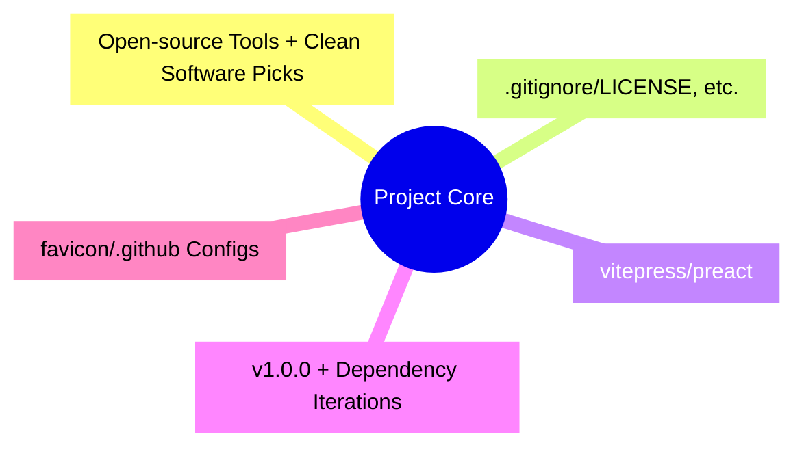

<H1 align="center"> 
  
</H1>

## build status

## map

```mermaid
mindmap
  root((Project Core))
    Positioning[Open-source Tools + Clean Software Picks]
    Base Files[.gitignore/LICENSE, etc.]
    Build Dependencies[vitepress/preact]
    Version Updates[v1.0.0 + Dependency Iterations]
    Auxiliary Resources[favicon/.github Configs]
```

